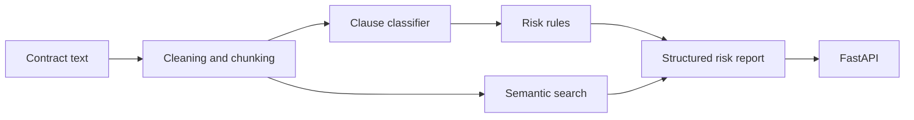

# Contract Risk Analyzer

Contract Risk Analyzer is a production-style NLP system for contract clause classification, semantic clause search, and risk triage. It combines a TF-IDF baseline, optional transformer fine-tuning, rule-based risk scoring, FastAPI deployment, Docker, tests, CI, and documentation.

**Disclaimer:** This tool is for document analysis and risk triage only. It is not legal advice and does not replace review by a qualified lawyer.

## Why This Matters

Contract review is time-consuming and repetitive. NLP can help route clauses, surface potential review points, and retrieve similar provisions, but the output remains assistive. Clause classification and heuristic risk scoring do not establish legal validity, enforceability, or business acceptability.

## Architecture



## Features

- LexGLUE LEDGAR data download and preparation pipeline
- Optional CUAD preparation extension when public download is available
- TF-IDF + Logistic Regression baseline
- Optional Hugging Face transformer training pipeline
- Evaluation metrics: accuracy, macro F1, micro F1, weighted F1, per-class report, top confusions
- Rule-based risk scoring with uncertainty handling
- Semantic clause search with TF-IDF fallback and optional SentenceTransformers
- FastAPI service with mock-safe startup
- Docker and docker-compose setup
- Fast deterministic tests and GitHub Actions CI
- Model card, dataset notes, error-analysis and benchmark templates

## Dataset

Primary dataset: LexGLUE LEDGAR, a contract provision classification dataset.

No datasets are committed. Download and prepare locally:

```bash
python -m pip install -e ".[data]"
make download-ledgar
```

Sample data under `data/samples/` is tiny and committed only for tests and demos. CUAD support is optional and documented in [docs/dataset_notes.md](docs/dataset_notes.md).

## Modeling

The baseline is TF-IDF + Logistic Regression with optional class balancing. Macro F1 is emphasized because legal clause datasets can be imbalanced and rare classes matter. Transformer fine-tuning is available through:

```bash
make train-transformer-debug
```

CI does not train transformers or download models.

## Evaluation

Evaluation supports accuracy, macro F1, micro F1, weighted F1, per-class metrics, top confusions, low-confidence examples, and high-confidence wrong predictions. This repository does not include fake LEDGAR metrics. After downloading data and training:

```bash
make train-baseline
make evaluate
```

Latest local baseline run on LEDGAR in this workspace:

- validation macro F1: `0.7737`
- test accuracy: `0.8307`
- test macro F1: `0.7826`
- test weighted F1: `0.8332`

These metrics were produced by `python scripts/train_baseline.py --config configs/baseline.yaml` and `python scripts/evaluate_model.py --config configs/baseline.yaml --model models/baseline_tfidf.joblib`. Model weights, processed dataset files, and generated reports are intentionally not committed.

## Demo

Run deterministic mock analysis without external data:

```bash
make analyze-sample
```

Equivalent command:

```bash
python scripts/analyze_document.py --input data/samples/sample_contract.txt --output data/outputs/risk_report.json --mock
```

Generated output includes fields like:

```json
{
  "document_id": "sample_contract",
  "summary": "...",
  "overall_risk_score": 0,
  "risk_flags": ["..."],
  "disclaimer": "This tool is for document analysis and risk triage only. It is not legal advice and does not replace review by a qualified lawyer."
}
```

## API Usage

Start the API in mock mode:

```bash
make api
```

Example requests:

```bash
curl http://localhost:8000/health
curl http://localhost:8000/model/info
curl -X POST http://localhost:8000/analyze/clause -H "Content-Type: application/json" -d "{\"text\":\"Either party may terminate without cause.\"}"
curl -X POST http://localhost:8000/analyze/document -H "Content-Type: application/json" -d "{\"document_id\":\"demo\",\"text\":\"Customer shall pay invoices. Either party may terminate.\"}"
curl -X POST http://localhost:8000/search/similar -H "Content-Type: application/json" -d "{\"query\":\"termination without cause\",\"top_k\":3}"
curl http://localhost:8000/metrics
```

More examples are in [docs/api_usage.md](docs/api_usage.md).

## Docker

```bash
make docker-build
make docker-run
```

The image does not include datasets, model weights, or retrieval indexes.

## Limitations

- Not legal advice and not a substitute for a qualified lawyer
- Models trained on LEDGAR may not generalize to all contracts
- Legal language varies across jurisdictions and industries
- Clause classification does not determine legal validity
- Risk scoring is heuristic and can miss important issues
- Long clauses, rare labels, boilerplate, and ambiguous wording remain difficult
- Human review is required

## Roadmap

- CUAD-based clause extraction task
- Long-context transformer support
- Retrieval reranking
- Calibrated confidence estimates
- Active learning and human feedback loop
- Model monitoring and drift checks
- Multilingual legal-document support

---

# Contract Risk Analyzer

Contract Risk Analyzer — это production-style NLP-система для классификации договорных положений, семантического поиска похожих clauses и первичной risk triage-оценки. Проект объединяет TF-IDF baseline, опциональное fine-tuning transformer-модели, rule-based risk scoring, FastAPI, Docker, tests, CI и документацию.

**Дисклеймер:** этот инструмент предназначен только для анализа документов и первичной triage-оценки рисков. Это не юридическая консультация и не замена проверке квалифицированным юристом.

## Зачем Этот Проект

Проверка договоров часто занимает много времени и включает повторяющиеся задачи. NLP может помочь классифицировать clauses, подсветить потенциальные точки для проверки и найти похожие положения, но результат остается вспомогательным. Классификация clauses и эвристический risk scoring не определяют юридическую действительность, исполнимость или приемлемость условий для бизнеса.

## Архитектура


## Возможности

- Pipeline загрузки и подготовки LexGLUE LEDGAR
- Опциональное расширение для CUAD, если публичная загрузка доступна
- TF-IDF + Logistic Regression baseline
- Опциональный Hugging Face transformer training pipeline
- Evaluation metrics: accuracy, macro F1, micro F1, weighted F1, per-class report, top confusions
- Rule-based risk scoring с учетом uncertainty
- Semantic clause search с TF-IDF fallback и опциональным SentenceTransformers
- FastAPI service, который стартует без внешних датасетов и весов модели в mock mode
- Docker и docker-compose
- Быстрые детерминированные тесты и GitHub Actions CI
- Model card, dataset notes, error-analysis и benchmark templates

## Датасет

Основной датасет: LexGLUE LEDGAR, датасет для классификации договорных положений.

Датасеты не коммитятся. Скачивание и подготовка локально:

```bash
python -m pip install -e ".[data]"
make download-ledgar
```

Tiny sample data в `data/samples/` используется только для тестов и демо. CUAD поддерживается как опциональное расширение и описан в [docs/dataset_notes.md](docs/dataset_notes.md).

## Моделирование

Baseline — TF-IDF + Logistic Regression с опциональным class balancing. Macro F1 важен, потому что legal clause datasets могут быть несбалансированными, а редкие классы тоже имеют значение. Transformer fine-tuning доступен через:

```bash
make train-transformer-debug
```

CI не обучает transformers и не скачивает большие модели.

## Оценка

Evaluation поддерживает accuracy, macro F1, micro F1, weighted F1, per-class metrics, top confusions, low-confidence examples и high-confidence wrong predictions.

После скачивания данных и обучения:

```bash
make train-baseline
make evaluate
```

Последний локальный baseline-прогон на LEDGAR в этом workspace:

- validation macro F1: `0.7737`
- test accuracy: `0.8307`
- test macro F1: `0.7826`
- test weighted F1: `0.8332`

Эти метрики получены командами `python scripts/train_baseline.py --config configs/baseline.yaml` и `python scripts/evaluate_model.py --config configs/baseline.yaml --model models/baseline_tfidf.joblib`. Веса модели, processed dataset files и generated reports намеренно не коммитятся.

## Демо

Детерминированный mock-анализ без внешних данных:

```bash
make analyze-sample
```

Эквивалентная команда:

```bash
python scripts/analyze_document.py --input data/samples/sample_contract.txt --output data/outputs/risk_report.json --mock
```

Сгенерированный output содержит поля:

```json
{
  "document_id": "sample_contract",
  "summary": "...",
  "overall_risk_score": 0,
  "risk_flags": ["..."],
  "disclaimer": "This tool is for document analysis and risk triage only. It is not legal advice and does not replace review by a qualified lawyer."
}
```

## API

Запуск API в mock mode:

```bash
make api
```

Примеры запросов:

```bash
curl http://localhost:8000/health
curl http://localhost:8000/model/info
curl -X POST http://localhost:8000/analyze/clause -H "Content-Type: application/json" -d "{\"text\":\"Either party may terminate without cause.\"}"
curl -X POST http://localhost:8000/analyze/document -H "Content-Type: application/json" -d "{\"document_id\":\"demo\",\"text\":\"Customer shall pay invoices. Either party may terminate.\"}"
curl -X POST http://localhost:8000/search/similar -H "Content-Type: application/json" -d "{\"query\":\"termination without cause\",\"top_k\":3}"
curl http://localhost:8000/metrics
```

Больше примеров — в [docs/api_usage.md](docs/api_usage.md).

## Docker

```bash
make docker-build
make docker-run
```

Docker image не включает датасеты, model weights или retrieval indexes.

## Ограничения

- Не является юридической консультацией и не заменяет квалифицированного юриста
- Модели, обученные на LEDGAR, могут плохо обобщаться на все типы договоров
- Юридический язык зависит от юрисдикции и отрасли
- Классификация clause не определяет юридическую действительность условия
- Risk scoring является эвристическим и может пропускать важные риски
- Long clauses, rare labels, boilerplate и ambiguous wording остаются сложными случаями
- Human review обязателен

## Roadmap

- CUAD-based clause extraction task
- Long-context transformer support
- Retrieval reranking
- Calibrated confidence estimates
- Active learning and human feedback loop
- Model monitoring and drift checks
- Multilingual legal-document support
