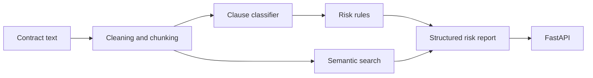

# Contract Risk Analyzer

Contract Risk Analyzer - это портфолио-проект по NLP для анализа договорных документов. Он классифицирует положения договора, подсвечивает простые риск-индикаторы, ищет похожие clauses и отдает результат через FastAPI.

Я делал этот проект не как notebook-demo, а как небольшую инженерную систему. Здесь важны воспроизводимый data pipeline, baseline-модель, evaluation, error analysis, генерация структурированного отчета, API, Docker, тесты, CI и честное описание ограничений.

**Важный дисклеймер:** этот инструмент предназначен только для анализа документов и первичной triage-оценки рисков. Это не юридическая консультация и не замена проверке квалифицированным юристом.

## Зачем Это Нужно

В договорах много повторяющейся структуры: termination, governing law, payment terms, indemnification, confidentiality, assignment и другие типовые положения. NLP может помочь разобрать документ на части, классифицировать clauses и показать места, которые стоит внимательнее проверить.

Я выбрал эту тему, потому что у меня есть юридический background, и мне было интересно соединить его с практическим ML engineering. Этот опыт помогает трезво смотреть на задачу: цель проекта не в том, чтобы автоматизировать юридическое суждение, а в том, чтобы построить аккуратный workflow для анализа документов с понятными границами, прозрачными правилами и обязательной human review.

Но это не legal chatbot и не автоматический юрист. Проект решает более приземленную задачу: классифицировать текст, показать confidence, применить прозрачные правила и собрать отчет, который потом смотрит человек.

## Архитектура



## Что Есть В Проекте

- Pipeline для загрузки и подготовки LEDGAR
- Опциональная подготовка CUAD
- TF-IDF + Logistic Regression baseline
- Опциональный pipeline для transformer fine-tuning
- Evaluation: accuracy, macro F1, micro F1, weighted F1, per-class metrics, top confusions
- Rule-based risk scoring поверх предсказаний модели
- Semantic clause search с легким TF-IDF fallback
- FastAPI service, который работает в mock mode или с обученной локальной моделью
- Docker и docker-compose
- Unit tests, API tests, linting и GitHub Actions CI
- Model card, dataset notes, error analysis notes, benchmark template и release notes

## Датасет

Основной датасет - **LexGLUE LEDGAR**, публичный датасет для классификации положений договоров. Raw и processed данные не коммитятся. Они готовятся локально:

```bash
python -m pip install -e ".[data]"
python scripts/download_data.py --dataset ledgar
```

Pipeline сохраняет LEDGAR в JSONL splits:

- `ledgar_train.jsonl`
- `ledgar_validation.jsonl`
- `ledgar_test.jsonl`

Файлы в `data/samples/` маленькие и нужны только для тестов и демо без интернета.

## Моделирование

Основной baseline - TF-IDF плюс Logistic Regression. Это простая, быстрая и воспроизводимая модель, с которой удобно сравнивать более тяжелые transformer-подходы.

Macro F1 важен, потому что LEDGAR несбалансирован: accuracy может выглядеть хорошо, даже если модель плохо работает на редких классах.

Обучение baseline после скачивания LEDGAR:

```bash
python scripts/train_baseline.py --config configs/baseline.yaml
```

Transformer training тоже есть, но он не запускается в CI:

```bash
python scripts/train_transformer.py --config configs/transformer.yaml --max-train-samples 500 --max-eval-samples 200 --epochs 1
```

## Последние Локальные Метрики Baseline

Метрики ниже получены локально на реальных LEDGAR splits:

- validation macro F1: `0.7737`
- test accuracy: `0.8307`
- test macro F1: `0.7826`
- test weighted F1: `0.8332`

Команды:

```bash
python scripts/train_baseline.py --config configs/baseline.yaml
python scripts/evaluate_model.py --config configs/baseline.yaml --model models/baseline_tfidf.joblib
```

Обученная модель, processed dataset files и generated reports не коммитятся. Это локальные артефакты, они игнорируются Git.

Дополнительные latency-замеры и размер модели описаны в [docs/benchmark_report.md](docs/benchmark_report.md).

## Будет Ли Это Работать С Документами Беларуси Или России?

Технически сервис примет любой текст. Практически текущий baseline **нельзя считать надежным** для белорусских или российских договоров.

Модель обучена на LEDGAR, а это англоязычный датасет договорных положений. Значит, модель выучила английские legal drafting patterns и label conventions из LEDGAR. Русскоязычные или белорусскоязычные договоры, а также документы под правом Беларуси или России - это другой домен.

Чтобы делать это нормально для Беларуси или России, нужны:

- русскоязычные и/или белорусскоязычные договорные данные
- локальная taxonomy clause types
- jurisdiction-aware risk rules, написанные вместе с юристами
- evaluation на representative local documents
- скорее всего, multilingual embeddings или multilingual transformer model

Честный вывод: проект можно использовать как инженерный framework, но текущая модель еще не является валидированной legal-domain моделью для Беларуси или России.

## Демо

Детерминированное демо без обученной модели:

```bash
python scripts/analyze_document.py \
  --input data/samples/sample_contract.txt \
  --output data/outputs/risk_report.json \
  --mock
```

Тот же flow с обученным baseline:

```bash
python scripts/analyze_document.py \
  --input data/samples/sample_contract.txt \
  --output data/outputs/risk_report_real_model.json \
  --model models/baseline_tfidf.joblib
```

Отчет содержит document id, predicted clause types, risk flags, severity breakdown, recommendations, overall score и legal disclaimer.

Короткий пример model-backed отчета есть в [docs/example_risk_report.md](docs/example_risk_report.md).

## API

Запуск в mock mode:

```bash
CONTRACT_RISK_MOCK_MODEL=true uvicorn contract_risk_analyzer.api.main:app --host 0.0.0.0 --port 8000
```

Запуск с обученным baseline:

```bash
CONTRACT_RISK_MOCK_MODEL=false CONTRACT_RISK_MODEL_PATH=models/baseline_tfidf.joblib uvicorn contract_risk_analyzer.api.main:app --host 0.0.0.0 --port 8000
```

Примеры запросов:

```bash
curl http://localhost:8000/health
curl http://localhost:8000/model/info
curl -X POST http://localhost:8000/analyze/clause -H "Content-Type: application/json" -d "{\"text\":\"Either party may terminate without cause.\"}"
curl -X POST http://localhost:8000/analyze/document -H "Content-Type: application/json" -d "{\"document_id\":\"demo\",\"text\":\"Customer shall pay invoices. Either party may terminate.\"}"
curl -X POST http://localhost:8000/search/similar -H "Content-Type: application/json" -d "{\"query\":\"termination without cause\",\"top_k\":3}"
curl http://localhost:8000/metrics
```

Больше API-примеров есть в [docs/api_usage.md](docs/api_usage.md).

## Docker

```bash
docker build -t contract-risk-analyzer:local .
docker run --rm -p 8000:8000 -e CONTRACT_RISK_MOCK_MODEL=true contract-risk-analyzer:local
```

Image не включает датасеты, model weights или retrieval indexes.

## Тесты

Тесты маленькие и детерминированные. Им не нужны интернет, GPU, Hugging Face downloads, FAISS или обученные веса модели.

```bash
python -m compileall src tests scripts
python -m pytest -q
python -m ruff check src tests scripts
```

## Ограничения

- Это не юридическая консультация.
- Risk scoring является эвристикой.
- LEDGAR classification не равна юридической действительности условия.
- Текущий baseline работает в английском домене.
- Белорусские и российские юридические документы находятся вне домена текущей модели.
- Long clauses, boilerplate, rare labels и ambiguous provisions остаются сложными случаями.
- Перед юридическими или бизнес-решениями нужен human review.

## Roadmap

- Добавить полноценный CUAD extraction workflow
- Попробовать multilingual model для неанглоязычных договоров
- Добавить calibrated confidence estimates
- Улучшить retrieval reranking
- Добавить human feedback loops
- Добавить model monitoring и drift checks
- Собрать отдельный evaluation set для российских и белорусских договоров

---

English version: [README.md](README.md).
